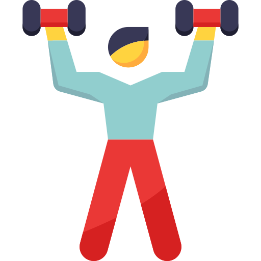
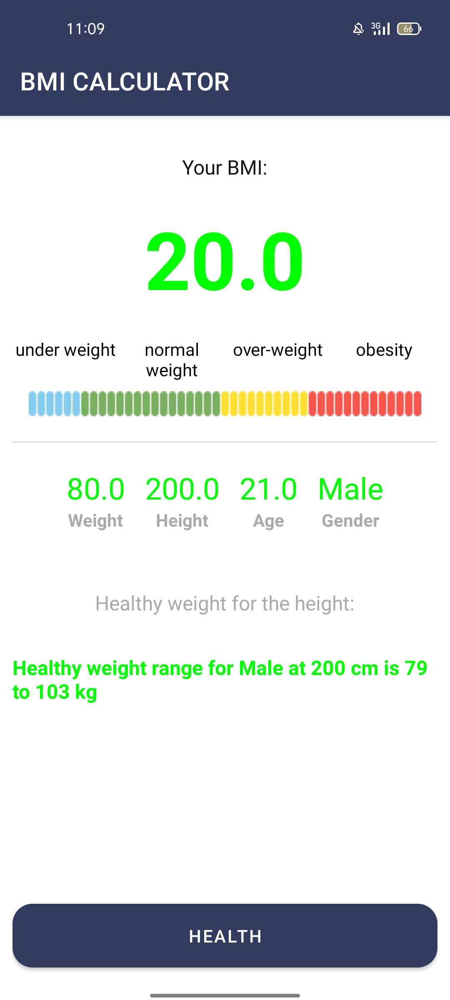

# BMI CALCULATOR APP

**BMI Calculator App** is a modern Android application developed in **Kotlin**. It calculates the **Body Mass Index (BMI)** based on the user’s weight, height, and age, and offers **diet suggestions**.

Published on the **Huawei AppGallery**:  
🔗 [Download from Huawei AppGallery](https://appgallery.huawei.com/app/C112270379).

 ## screenshots

 

 

 

## Build and Run NewsApp

1. Clone the repository.

2. Open the project in Android Studio.

3. Sync the Gradle files and run the app module

## Built with 
- [Kotlin](https://kotlinlang.org/) – Modern programming language for Android development
- [MVVM Architecture](https://developer.android.com/jetpack/guide) – Separation of concerns with ViewModel and LiveData
- [LiveData](https://developer.android.com/topic/libraries/architecture/livedata) – Lifecycle-aware data holder
- [ViewModel](https://developer.android.com/topic/libraries/architecture/viewmodel) – UI-related data holder that survives configuration changes
- [MPAndroidChart](https://github.com/PhilJay/MPAndroidChart) – Powerful charting library for Android
- [Material Design](https://m3.material.io/) – UI/UX components for modern Android apps
- [Huawei AppGallery](https://developer.huawei.com/consumer/en/appgallery) – Platform where the app is published

### ✨ Features

- 🧮 **Accurate BMI Calculation**  
  Calculate BMI instantly based on your height, weight, and age.

- 📊 **Interactive Chart Visualization**  
  Visualize your BMI category .

- 🔄 **Live Data Updates**  
  Leverages **LiveData** and **ViewModel** for seamless, real-time UI updates.

- 🍎 **Diet Recommendations**  
  Get health and diet suggestions.

- 📱 **Optimized for Huawei Devices**  
  Fully tested and published on the **Huawei Developer Console** for a smooth experience on Huawei smartphones.

##  Contributing
Contributions are welcome! Feel free to fork the repo, open issues, and submit pull requests
